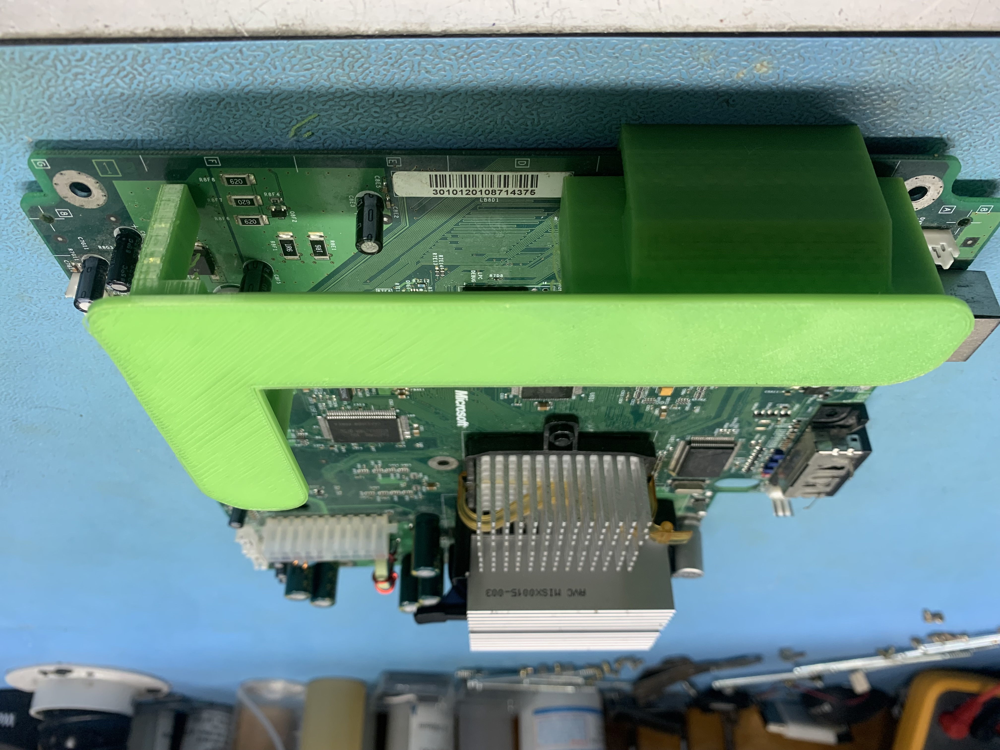
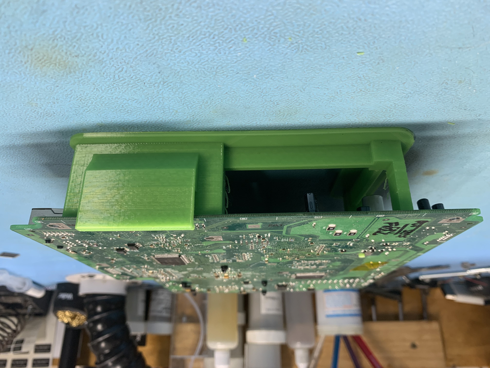
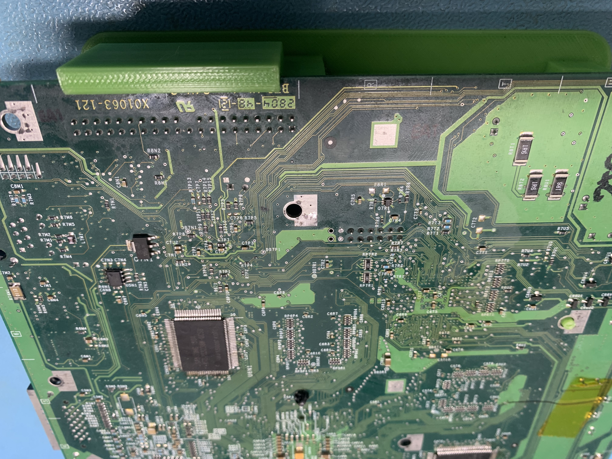
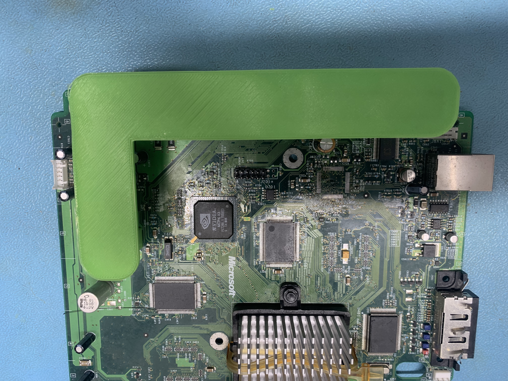

# XBOX-Motherboard-Support
This is an Universal Xbox motherboard support for all revisions on Xbox to allow easy rework/Ram upgrades fot the underside of the board. The print clips to the board and holds it level for reworking purposes. It sits over the IDE port and the rest I'm sure you can work out!
​
​
​
​
